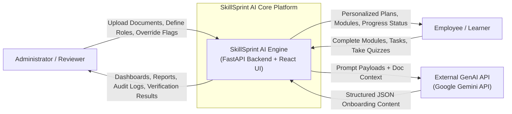
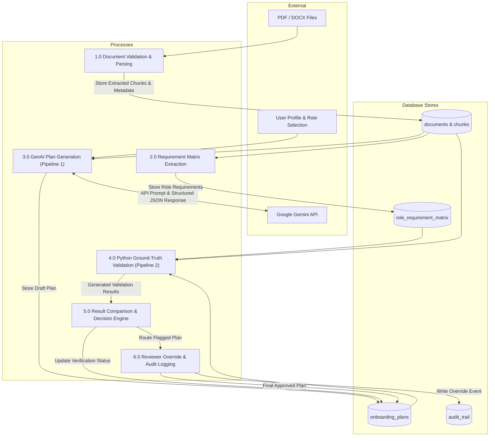
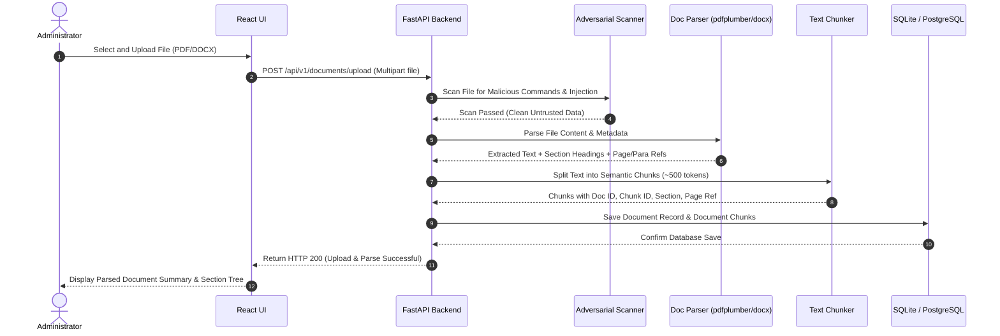
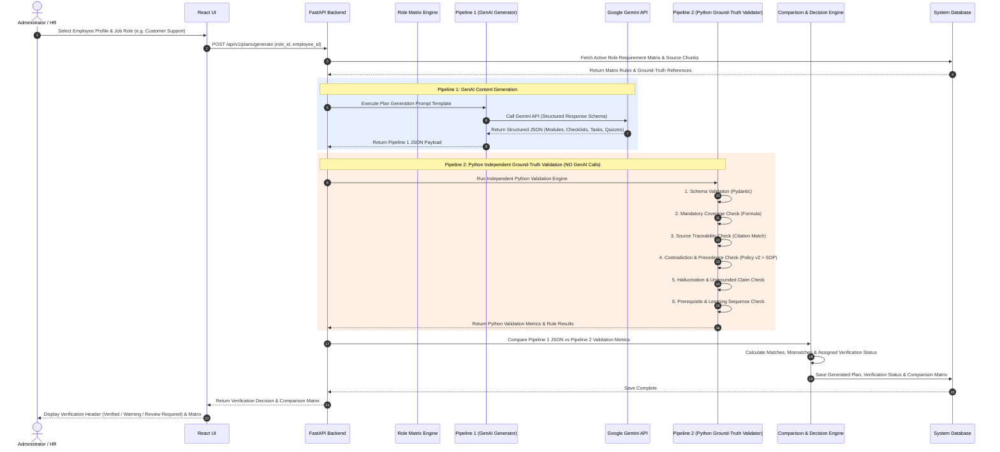
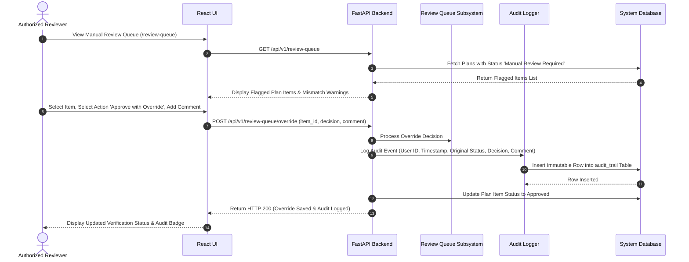

# SkillSprint AI — Data Flow Specification & Sequence Diagrams

## Overview
This document specifies the Data Flow Architecture for **SkillSprint AI**, including DFD Level 0 (Context Diagram), DFD Level 1, DFD Level 2, and Sequence Diagrams for all critical system workflows.

---

## 1. Data Flow Diagram Level 0 — Context Diagram



---

## 2. Data Flow Diagram Level 1 — Subsystem Data Flow



---

## 3. Core Sequence Diagrams

### Sequence Diagram 1: Document Ingestion, Parsing & Chunking



---

### Sequence Diagram 2: Dual-Pipeline Plan Generation & Verification



---

### Sequence Diagram 3: Policy Update & Selective Regeneration

```mermaid
sequenceDiagram
    autonumber
    actor Admin as Administrator
    participant UI as React UI
    participant API as FastAPI Backend
    participant Versioning as Version Control Subsystem
    participant Impact as Impact Analysis Engine
    participant GenAI as Pipeline 1 Generator
    participant DB as System Database

    Admin->>UI: Upload Replacement Policy File (e.g. HR-Policy_v2.docx)
    UI->>API: POST /api/v1/documents/policy-update (old_doc_id, new_file)
    API->>Versioning: Mark HR-Policy_v1 as Obsolete (is_active = False)
    API->>Impact: Identify Affected Modules, Quizzes, and Employee Plans
    Impact->>DB: Query Plans Referencing HR-Policy_v1
    DB-->>Impact: Return 15 Affected Employee Onboarding Plans
    Impact->>DB: Update Status of Affected Plans (is_outdated = True)
    Impact-->>API: Return Impact Analysis Summary (Affected Modules & Plans)
    API-->>UI: Display Impact Analysis Tree (15 Plans, 3 Modules Affected)
    
    Admin->>UI: Click "Regenerate Affected Modules Only"
    UI->>API: POST /api/v1/plans/regenerate-selective (plan_ids, module_ids)
    API->>GenAI: Regenerate ONLY Affected Modules using HR-Policy_v2
    GenAI-->>API: Return Updated Module Content
    API->>DB: Update Affected Modules; Retain Unchanged Modules
    API-->>UI: Return Selective Regeneration Complete Notification
```

---

### Sequence Diagram 4: Manual Reviewer Override & Audit Logging


