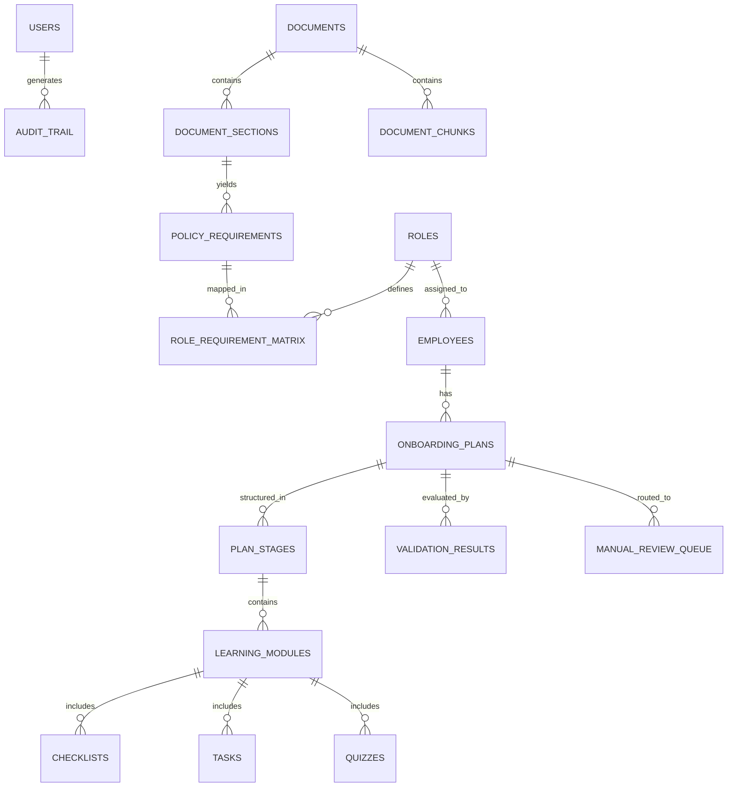

# SkillSprint AI — Database Architecture Specification

## Overview
This document specifies the domain entity model, database schema layout, relationship mappings, indexing strategy, and ORM abstractions for **SkillSprint AI** as required by Step 11 of the SRS Discovery Phase.

The database is designed using **SQLAlchemy 2.0 ORM** supporting **SQLite** for local development and **PostgreSQL** for cloud production deployment.

---

## 1. Domain Entities & Database Table Schema

---

## 2. Entity Specifications

### 1. `users` Table
- `user_id` (UUID, Primary Key)
- `email` (VARCHAR(255), Unique, Indexed)
- `hashed_password` (VARCHAR(255))
- `full_name` (VARCHAR(255))
- `role` (VARCHAR(50)) -- `Admin`, `TrainingManager`, `Reviewer`, `Manager`, `Employee`
- `is_active` (BOOLEAN)
- `created_at` (TIMESTAMP)

### 2. `roles` Table
- `role_id` (VARCHAR(50), Primary Key)
- `role_name` (VARCHAR(255), Unique, Indexed)
- `department` (VARCHAR(100))
- `description` (TEXT)
- `created_at` (TIMESTAMP)

### 3. `employees` Table
- `employee_id` (VARCHAR(50), Primary Key)
- `user_id` (UUID, Foreign Key -> `users.user_id`)
- `job_role_id` (VARCHAR(50), Foreign Key -> `roles.role_id`)
- `department` (VARCHAR(100))
- `experience_level` (VARCHAR(50)) -- `Junior`, `Mid`, `Senior`
- `joining_date` (DATE)
- `manager_id` (VARCHAR(50))
- `training_status` (VARCHAR(50))

### 4. `documents` Table
- `document_id` (VARCHAR(50), Primary Key)
- `title` (VARCHAR(255))
- `file_name` (VARCHAR(255))
- `file_type` (VARCHAR(20)) -- `pdf`, `docx`
- `category` (VARCHAR(100))
- `department` (VARCHAR(100))
- `version` (VARCHAR(20))
- `effective_date` (DATE)
- `expiry_date` (DATE)
- `is_active` (BOOLEAN, Default True)
- `file_hash` (VARCHAR(64))

### 5. `document_chunks` Table
- `chunk_id` (VARCHAR(50), Primary Key)
- `document_id` (VARCHAR(50), Foreign Key -> `documents.document_id`)
- `section_heading` (VARCHAR(255))
- `page_number` (INTEGER) -- PDF
- `paragraph_ref` (VARCHAR(100)) -- DOCX
- `text_content` (TEXT)
- `created_at` (TIMESTAMP)

### 6. `policy_requirements` Table
- `requirement_id` (VARCHAR(50), Primary Key)
- `source_document_id` (VARCHAR(50), Foreign Key -> `documents.document_id`)
- `source_section_id` (VARCHAR(100))
- `requirement_type` (VARCHAR(50)) -- `Must Know`, `Must Complete`, `Must Demonstrate`, `Must Acknowledge`, `Recommended`, `Optional`
- `is_mandatory` (BOOLEAN)
- `requirement_text` (TEXT)
- `category` (VARCHAR(100))

### 7. `role_requirement_matrix` Table
- `matrix_id` (UUID, Primary Key)
- `role_id` (VARCHAR(50), Foreign Key -> `roles.role_id`)
- `requirement_id` (VARCHAR(50), Foreign Key -> `policy_requirements.requirement_id`)
- `priority` (VARCHAR(20)) -- `High`, `Medium`, `Low`
- `due_stage` (VARCHAR(50)) -- `Day 1`, `Week 1`, `Week 2`, `30 Days`, `60 Days`, `90 Days`
- `assessment_type` (VARCHAR(50))

### 8. `onboarding_plans` Table
- `plan_id` (VARCHAR(50), Primary Key)
- `employee_id` (VARCHAR(50), Foreign Key -> `employees.employee_id`)
- `role_id` (VARCHAR(50), Foreign Key -> `roles.role_id`)
- `coverage_score` (FLOAT)
- `traceability_score` (FLOAT)
- `consistency_score` (FLOAT)
- `verification_status` (VARCHAR(50)) -- `Verified`, `Verified with Warning`, `Incomplete`, `Unsupported`, `Contradictory`, `Manual Review Required`
- `is_outdated` (BOOLEAN, Default False)
- `created_at` (TIMESTAMP)

### 9. `learning_modules` Table
- `module_id` (VARCHAR(50), Primary Key)
- `plan_id` (VARCHAR(50), Foreign Key -> `onboarding_plans.plan_id`)
- `stage_name` (VARCHAR(50))
- `module_title` (VARCHAR(255))
- `purpose` (TEXT)
- `estimated_duration` (VARCHAR(50))
- `source_document_id` (VARCHAR(50))
- `source_section_id` (VARCHAR(100))
- `is_mandatory` (BOOLEAN)

### 10. `checklists` Table
- `checklist_id` (VARCHAR(50), Primary Key)
- `module_id` (VARCHAR(50), Foreign Key -> `learning_modules.module_id`)
- `activity` (TEXT)
- `due_stage` (VARCHAR(50))
- `is_required` (BOOLEAN)
- `status` (VARCHAR(50)) -- `Pending`, `Completed`
- `source_ref` (VARCHAR(255))

### 11. `tasks` Table
- `task_id` (VARCHAR(50), Primary Key)
- `module_id` (VARCHAR(50), Foreign Key -> `learning_modules.module_id`)
- `task_description` (TEXT)
- `expected_outcome` (TEXT)
- `completion_criteria` (TEXT)
- `difficulty` (VARCHAR(20)) -- `Beginner`, `Intermediate`, `Advanced`
- `is_scenario` (BOOLEAN)
- `due_stage` (VARCHAR(50))

### 12. `quizzes` & `quiz_questions` Tables
- `quiz_id` (VARCHAR(50), Primary Key)
- `module_id` (VARCHAR(50), Foreign Key -> `learning_modules.module_id`)
- `question_id` (VARCHAR(50), Primary Key)
- `question_type` (VARCHAR(50)) -- `MCQ`, `MultipleResponse`, `TrueFalse`, `Scenario`
- `question_text` (TEXT)
- `correct_answer` (TEXT)
- `explanation` (TEXT)
- `source_document_id` (VARCHAR(50))
- `source_section_id` (VARCHAR(100))

### 13. `audit_trail` Table (Append-Only)
- `audit_id` (UUID, Primary Key)
- `timestamp` (TIMESTAMP, Default CURRENT_TIMESTAMP)
- `user_id` (VARCHAR(50))
- `user_role` (VARCHAR(50))
- `action_type` (VARCHAR(100)) -- `REVIEWER_OVERRIDE`
- `plan_id` (VARCHAR(50))
- `original_status` (VARCHAR(50))
- `new_status` (VARCHAR(50))
- `reviewer_comment` (TEXT)

---

## 3. Database Indexes

- `CREATE INDEX idx_documents_hash ON documents(file_hash);`
- `CREATE INDEX idx_chunks_doc ON document_chunks(document_id);`
- `CREATE INDEX idx_matrix_role ON role_requirement_matrix(role_id);`
- `CREATE INDEX idx_plans_employee ON onboarding_plans(employee_id);`
- `CREATE INDEX idx_modules_plan ON learning_modules(plan_id);`
- `CREATE INDEX idx_audit_plan ON audit_trail(plan_id);`
