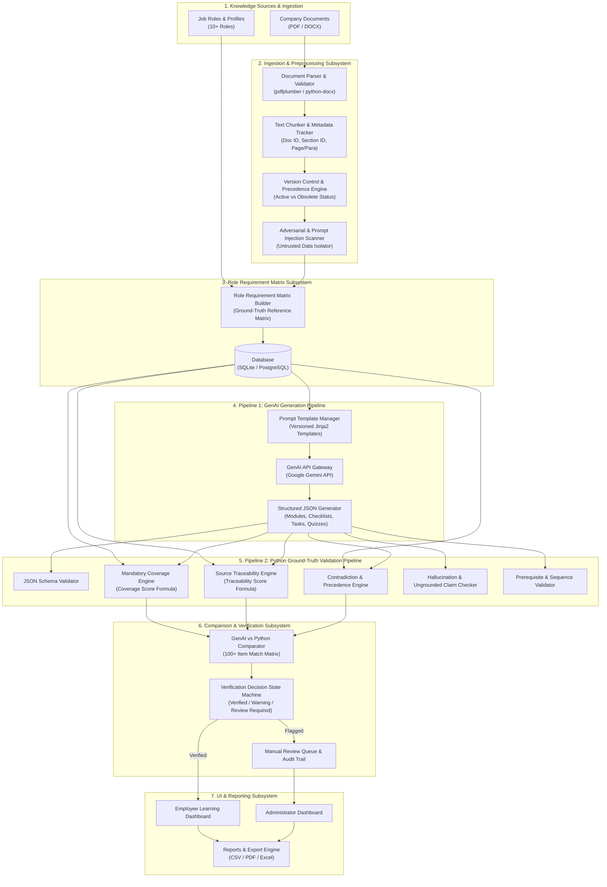
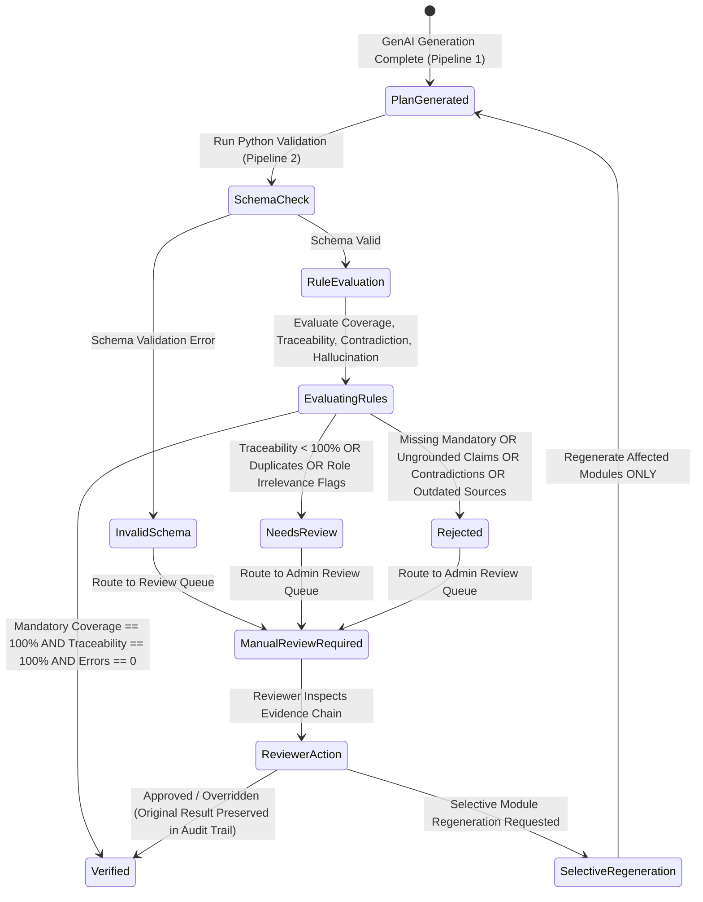

# SkillSprint AI — System Architecture Specification

## Executive Summary
**SkillSprint AI** is an enterprise-grade Generative AI training and onboarding intelligence application built on Python 3.14.7, FastAPI, and React.

The architecture strictly enforces the **Core Architecture Principle**: Generative AI and Python validation MUST remain independent. GenAI handles natural language comprehension and personalized content generation, while a deterministic Python Ground-Truth Engine independently validates compliance coverage, source traceability, role relevance, policy precedence, and contradictions without relying on AI self-approval.

---

## 1. High-Level Architectural Overview

---

## 2. Core Architectural Subsystems

### Subsystem A: Document Ingestion & Structuring Pipeline
1. **Document Validation**: Checks file size (< 25MB), file mime type (`application/pdf`, `application/vnd.openxmlformats-officedocument.wordprocessingml.document`), duplicate hashes, and empty text.
2. **Text Parsing & Metadata Extraction**:
   - `PDF`: Extracts page numbers, heading tags, paragraph blocks.
   - `DOCX`: Extracts paragraph indices, table cells, heading styles (`Heading 1`, `Heading 2`).
3. **Chunking Engine**: Divides parsed text into semantic chunks (~500 tokens) retaining `document_id`, `chunk_id`, `section_id`, `heading`, `page_number`, `paragraph_ref`, `version`, `effective_date`.
4. **Adversarial Scanner**: Scans text for malicious prompt injection patterns (`"ignore previous instructions"`, `"system override"`). Isolates text in `<untrusted_document_data>` tags.

### Subsystem B: Role Requirement Matrix Subsystem
1. **Matrix Extraction**: Python rule engine parses approved active documents to extract actionable requirements.
2. **Classification**: Maps requirement to `Must Know`, `Must Complete`, `Must Demonstrate`, `Must Acknowledge`, `Recommended`, `Optional`.
3. **Role Binding**: Maps extracted requirements to target job roles, assigning priority (`High`, `Medium`, `Low`), due stage (`Day 1`, `Week 1`, `Week 2`, `First 30/60/90 Days`), and assessment type.
4. **Ground-Truth Store**: Persists matrix in `role_requirement_matrix` table as the immutable ground-truth benchmark for validation.

### Subsystem C: Pipeline 1 — Python GenAI Generation Pipeline
1. **Template Manager**: Loads prompt templates from `prompt_templates/v1/` with version tracking.
2. **Context Assembler**: Retrieves relevant document chunks and target role profile from database.
3. **GenAI API Execution**: Calls Google Gemini API (`gemini-2.5-flash`) enforcing structured JSON response schemas (`schemas/onboarding_plan_schema.json`).
4. **Output Construction**: Emits structured JSON payload containing onboarding stages, modules, checklists, tasks, quizzes (MCQ, True/False, Scenario), and assessments with source citations.

### Subsystem D: Pipeline 2 — Python Ground-Truth Validation Pipeline (GenAI Independent)
1. **Schema & Integrity Validation**: Pydantic v2 validates JSON data types, required fields, and non-empty IDs.
2. **Deterministic Coverage Engine**: Calculates `Coverage Score`:
   $$\text{Coverage Score} = \left( \frac{\text{Covered Mandatory Requirements}}{\text{Total Mandatory Requirements in Matrix}} \right) \times 100$$
3. **Source Traceability Engine**: Calculates `Traceability Score`:
   $$\text{Traceability Score} = \left( \frac{\text{Generated Items with Valid Source Reference}}{\text{Total Generated Mandatory Items}} \right) \times 100$$
4. **Contradiction & Precedence Engine**: Evaluates active document precedence rules (`Policy v2 > SOP > FAQ`) to identify conflicting generated statements or outdated policy references.
5. **Hallucination & Ungrounded Claim Detector**: Verifies whether generated factual statements have matching semantic chunks in the approved document repository.
6. **Prerequisite & Sequence Validator**: Builds a Directed Acyclic Graph (DAG) of modules to detect sequence violations (e.g. advanced task assigned before basic training prerequisite).

### Subsystem E: Comparison Engine, Verification Decision & Human Review Subsystem
Compares structured outputs from Pipeline 1 against Python ground-truth checks from Pipeline 2:

1. **Requirement-Level Comparison Engine (FR-42)**: Item-by-item comparison across 8 deterministic states:
   - `COVERED`: Requirement satisfied with verified active document citations.
   - `MISSING`: Mandatory requirement omitted from plan.
   - `PARTIALLY_COVERED`: Requirement mapped but missing comprehensive completion criteria.
   - `UNSUPPORTED`: Content statement has no backing text in source documents (ungrounded).
   - `CONTRADICTORY`: Content violates policy precedence hierarchy or conflicts with approved clauses.
   - `OUTDATED_SOURCE`: Requirement cites an obsolete or superseded document version.
   - `IRRELEVANT`: Requirement content assigned is irrelevant to target role scope.
   - `NEEDS_REVIEW`: Non-critical warnings, duplicates, or ambiguous items pending inspection.

2. **Verification Summary Engine (FR-43)**: Dynamically computes total requirements, mandatory total, mandatory covered, mandatory missing, coverage percentage, traceable items, untraceable items, traceability percentage, unsupported items, duplicates, contradictions, outdated sources, role irrelevancy, sequence errors, and verification decision (`VERIFIED`, `NEEDS_REVIEW`, `REJECTED`).

3. **Human Review Workflow & Reviewer Override (FR-44, FR-45)**: Enables authorized reviewers to inspect `Expected -> Generated -> Validated -> Decision` evidence, approve, reject, request revision, or override validation findings while preserving original validator results intact.

4. **Immutable Audit Trail (FR-45)**: Append-only audit logger tracking 9 event types (`DOCUMENT_CHANGE`, `POLICY_VERSION_CHANGE`, `GENERATION_EVENT`, `VALIDATION_EVENT`, `COMPARISON_EVENT`, `VERIFICATION_DECISION`, `REVIEWER_ACTION`, `OVERRIDE`, `REGENERATION_EVENT`).

5. **Policy Update Impact & Selective Regeneration (FR-53, FR-54, FR-55)**: Traces policy version changes across requirements, roles, plans, modules, tasks, and quizzes. Selectively regenerates affected modules while preserving untouched content intact.

---

## 3. Technology Integration & Architecture Guarantees

| Subsystem Component | Selected Technology | Architecture Guarantee |
| :--- | :--- | :--- |
| **Backend API Framework** | FastAPI (Python 3.14.7) | Asynchronous, high-throughput REST service; auto OpenAPI documentation. |
| **Database Engine** | SQLite (Dev) / PostgreSQL (Prod) via SQLAlchemy | Relational integrity; immutable audit logging; dynamic schema migration. |
| **Document Processing** | `pdfplumber`, `pypdf`, `python-docx` | Full metadata retention (`Doc ID`, `Section ID`, `Page/Para Ref`) for 100% traceability. |
| **GenAI Service Gateway**| Google Gemini API (`google-genai` SDK) | Enforced structured JSON output via response schemas; zero free-form output reliance. |
| **Validation Engine** | Pydantic v2 + Custom Python Rule Engines | 100% independent deterministic verification; zero GenAI API dependency for approval. |
| **Frontend UI System** | React (Vite) + TailwindCSS / Bootstrap | Responsive, stateful single-page app with interactive comparison matrix & dashboards. |
| **Security Layer** | Delimiter Isolation + Keyword Scanner | Prompt injection immunity; strict PII scrubbing; immutable audit logging. |
