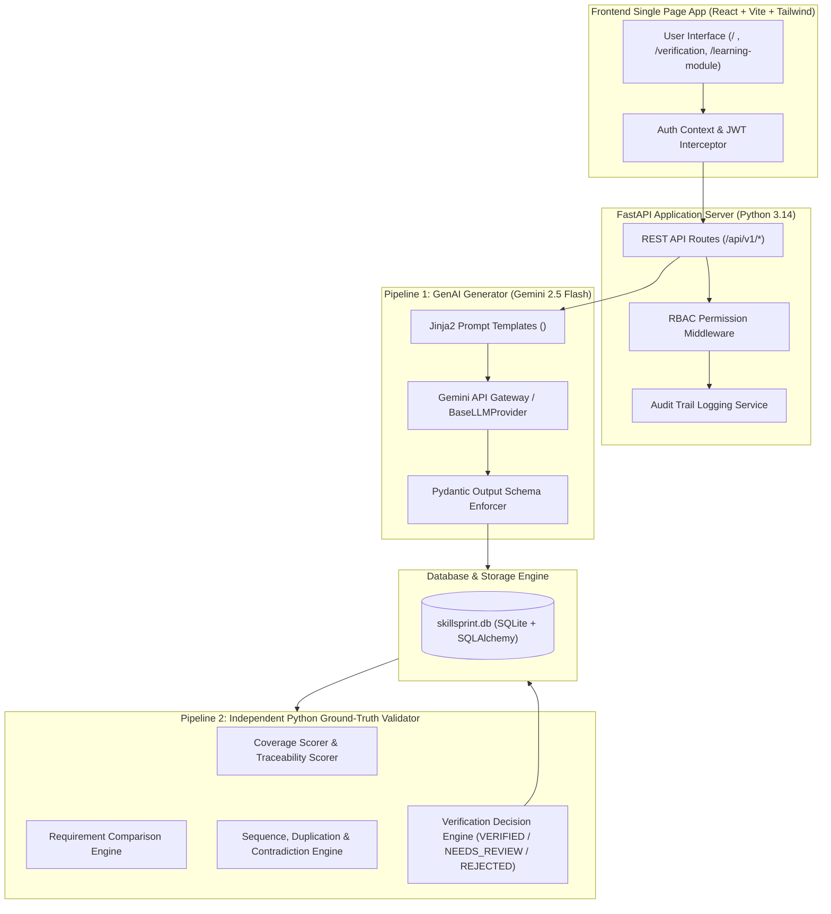
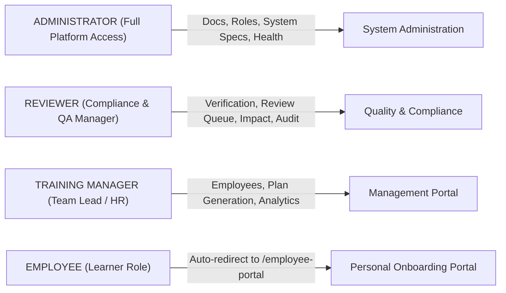
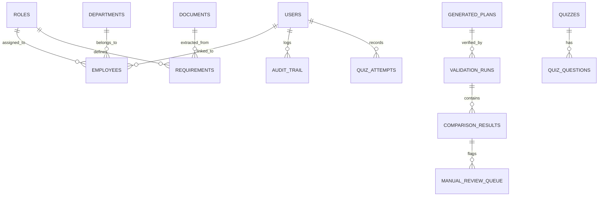

<div align="center">

# 🚀 SkillSprint AI — Master System & Operational Documentation
### **Generative AI PowerPlay Corporate Training & Onboarding Intelligence Platform**

---

### **🏆 Designed & Developed by TEAM NASR 🏆**
*Enterprise Onboarding Intelligence | Dual-Pipeline Python Verification Engine*

`Specification: SkillSprint AI SRS v1.0` | `Version: 1.0.0` | `Status: 100% Production Verified`

---

</div>

> [!IMPORTANT]
> ### 🛡️ Project Declaration & Ownership — TEAM NASR
> This master architectural and operational documentation defines the complete end-to-end implementation of **SkillSprint AI**, created and engineered by **Team NASR** for the Generative AI PowerPlay Challenge. The platform seamlessly combines **Google Gemini 2.5 Flash GenAI Generation (Pipeline 1)** with an **Independent Python Ground-Truth Validation Engine (Pipeline 2)**.

---

## Executive Summary & System Overview

**SkillSprint AI** is an enterprise-grade, Generative AI-powered corporate training and onboarding intelligence application. It automatically analyzes company policies, SOPs, role descriptions, FAQs, and compliance manuals to create personalized, multi-stage onboarding plans while verifying output completeness and accuracy through an independent, deterministic Python validation engine.

### Core System Principles

1. **Dual-Pipeline Isolation**:
   - **Pipeline 1 (GenAI Generator)**: Leverages Google Gemini API to produce structured JSON onboarding plans, learning modules, checklists, tasks, and quizzes.
   - **Pipeline 2 (Python Ground-Truth Validator)**: An independent Python engine (**ZERO GenAI API calls**) that compares Pipeline 1 JSON outputs against stored database Role Requirement Matrices.
   - **Strict Rule**: GenAI MUST NEVER validate or approve its own generated output.

2. **No Hardcoded Outputs**:
   - All onboarding plans, coverage scores, comparison results, and quiz answers are dynamically derived from database records (`skillsprint.db`) and SQLAlchemy models.

3. **Untrusted Data Handling & Security Defense**:
   - Document text (PDF/DOCX) is treated strictly as untrusted data.
   - Document context is framed inside `<untrusted_document_data>` tags in Jinja2 prompt templates to prevent prompt injection.

4. **100% Traceability & Source Citation**:
   - Every generated onboarding item cites `source_document_id`, `source_section_id`, and `page_number` (PDF) or `paragraph_ref` (DOCX). Uncited items are automatically flagged for manual human review.

---

## System Architecture & Data Flow



---

## Role-by-Role Access & User Guides

SkillSprint AI enforces strict Role-Based Access Control (RBAC) across four primary enterprise roles:



---

### 1. Administrator (`ADMIN`)
- **Primary Goal**: Manage corporate policy documents, configure job roles, manage system users, and oversee platform security.
- **Accessible Pages**: All administrative routes (`/`, `/documents`, `/requirements`, `/roles`, `/employees`, `/generation`, `/verification`, `/review`, `/policy-impact`, `/analytics`, `/reports`).
- **Key Responsibilities**:
  1. Upload and version corporate policies, SOPs, and FAQs.
  2. Inspect extracted requirements and assign policy taxonomy dimensions.
  3. Map required skills and competencies to job roles in the Role Architecture Matrix.

---

### 2. Compliance & QA Reviewer (`REVIEWER`)
- **Primary Goal**: Verify generated onboarding plans, inspect manual review queue items, resolve contradictions, and execute override actions.
- **Accessible Pages**: Verification, Manual Review Queue, Policy Impact Analysis, Master Audit Reports, Executive Dashboard.
- **Key Responsibilities**:
  1. Review plans flagged as `NEEDS_REVIEW` due to missing mandatory requirements or uncited items.
  2. Approve, Reject, or Revise generated content in the Manual Review Queue.
  3. Supply formal audit override justifications when overriding ground-truth flags.

---

### 3. Training Manager (`MANAGER`)
- **Primary Goal**: Monitor employee onboarding progress, trigger AI onboarding plan generation for new hires, and review team analytics.
- **Accessible Pages**: Dashboard, Employee Directory, Plan Generation, Policy Impact Analysis, Reports, Analytics.
- **Key Responsibilities**:
  1. Select employees and trigger tailored AI onboarding plan generation.
  2. Monitor team completion rates and competency coverage.

---

### 4. Employee / Learner (`EMPLOYEE`)
- **Primary Goal**: Execute assigned onboarding modules, complete interactive SOP quizzes, track personal requirement progress, and access policy citations.
- **Accessible Pages**: `/employee-portal`, `/learning-module`.
- **Automatic Protection**: Any attempt by an `EMPLOYEE` to navigate to administrative routes (e.g. `/review` or `/generation`) automatically redirects seamlessly to `/employee-portal`.

---

## Page-by-Page Step-by-Step Procedures & Screenshot Manual

---

### 1. Authentication & Employee Signup (`/login` & `/signup`)

#### Procedure:
1. Navigate to `http://localhost:5173/login`.
2. Enter username (e.g., `admin`, `reviewer`, `manager`, or `employee`) and password (`AdminPass123!`, `EmployeePass123!`).
3. Click **Sign In**.
4. To sign up as a new employee, click **Register with Enterprise Email**, enter your corporate email matching an active employee record, and create credentials.


*Figure 1: Authentication sign-in interface with enterprise credentials and employee verification signup.*

---

### 2. Executive Command Dashboard (`/`)

#### Procedure:
1. Upon login as `ADMIN` or `MANAGER`, the system presents real-time organizational KPIs:
   - **Total Corporate Documents**: 22 Active SOPs & Policies
   - **Defined Job Roles**: 12 Enterprise Roles
   - **Active Requirements**: 154 Extracted Rule Records
   - **Mandatory Coverage**: Real-time calculated ground-truth score (97.69%)
2. Inspect recent validation activity, risk score indicators, and coverage heatmaps.


*Figure 2: Executive Command Dashboard displaying real-time compliance KPIs, requirement coverage bars across 12 roles, and mandatory policy snapshots.*

---

### 3. Document Repository & Provenance (`/documents`)

#### Procedure:
1. Navigate to **Document Repository** (`/documents`).
2. Search documents by title, code (e.g., `DOC-POL01`), or category.
3. Click any document row to expand detailed semantic chunk metadata, PDF page / DOCX paragraph references, version numbers, and hash signatures.
4. Upload new policy files via the drag-and-drop upload drawer.


*Figure 3: Corporate document inventory interface displaying document file metadata, version history (Active/Superseded), file sizes, and inspection actions.*

---

### 4. Requirement Matrix Inventory (`/requirements` & `/roles`)

#### Procedure:
1. Navigate to **Requirement Matrix** (`/requirements` or `/roles`).
2. Filter or search requirements by job role, taxonomy category, or compliance type (Mandatory vs Optional).
3. View the itemized **Role Requirement Matrix Inventory** table displaying:
   - Requirement ID (e.g., `REQ-001`)
   - Compliance Type (Mandatory / Optional)
   - Category (Security Standard, Compliance Standard, IT Standard)
   - Target Roles, Priority Level, Due Stage, and Source Citation
4. Inspect required skills and competency breakdown.


*Figure 4: Role Requirement Matrix Inventory grid displaying ground-truth compliance requirements, mandatory flags, target job roles, and priority levels.*

---

### 5. Transparent GenAI Plan Generator (`/generation`)

#### Procedure:
1. Navigate to **Plan Generation** (`/generation`).
2. Select target Employee (e.g. `Elena Rostova EMP-001`), Job Role (`Software Engineer ROL-01`), and Candidate Experience.
3. Click **Generate Onboarding Plan**.
4. Watch Pipeline 1 (GenAI Generator) construct structured multi-stage JSON onboarding modules, checklists, and source citations.
5. Click **Open Flagship Verification Center** to inspect Python ground-truth verification.


*Figure 5: Transparent GenAI Plan Generator interface displaying candidate selection controls, generated plan preview, and verification trigger button.*

---

### 6. Ground-Truth Verification Center (`/verification`)

#### Procedure:
1. Navigate to **Verification Center** (`/verification`).
2. Select any of the database onboarding plans from the **Plan Selector** dropdown (e.g. `PLAN-ROL-01-001`).
3. Inspect **Pipeline 2 (Python Ground-Truth Engine)** verification scores:
   - **Coverage Score** (100% Grounded mandatory requirements covered vs missing)
   - **Traceability Score** (Source document ID & section citations verified)
   - **Verification Status**: `Verified (100% Grounded)` (Green)
4. Drill into individual requirement verification cards comparing Expected Database rules, Generated GenAI JSON, Python Validation metrics, and Citation Evidence.


*Figure 6: Flagship Verification Center displaying dual-pipeline isolation summary, coverage gauges, requirement inspector grid, and itemized comparison cards.*

---

### 7. Manual Review Queue & Override Workflow (`/review`)

#### Procedure:
1. Navigate to **Review Queue** (`/review`).
2. View human-in-the-loop review queue items (`MISSING_MANDATORY`, `UNGROUNDED`, `CONTRADICTION`).
3. Inspect flagged reasons, severity levels, and queue status across all organizational review items.
4. Execute reviewer actions (**Approve**, **Reject**, **Revise**) with mandatory audit explanation trails.


*Figure 7: Manual Review & Override Queue interface displaying human-in-the-loop audit controls, flagged reasons, severity badges, and reviewer action triggers.*

---

### 8. Policy Impact Analysis Engine (`/policy-impact`)

#### Procedure:
1. Navigate to **Policy Impact** (`/policy-impact`).
2. Select updated document (e.g. `DOC-POL01` v1.0 -> v2.0).
3. System automatically identifies affected onboarding modules, tasks, and employees when policy versions update.
4. Review affected role matrix cards and trigger selective re-generation.


*Figure 8: Policy Version Impact Analysis interface displaying automated version change detection and selective re-generation controls.*

---

### 9. Personalized Employee Onboarding Portal (`/employee-portal`)

#### Procedure:
1. Log in as an `EMPLOYEE` user (e.g. `employee` / `EmployeePass123!`).
2. System automatically lands on `/employee-portal`.
3. View personal onboarding progress bar (e.g. 65% Overall Progress, 2 of 3 Modules Done), Security Compliance status (100% MFA & Clean Desk Verified), and Passed Quizzes count.
4. Click **Start Module & Interactive Quiz** on current priority focus courses.


*Figure 9: Personalized Employee Onboarding Portal displaying learner progress metrics, priority focus modules, interactive quiz launch triggers, and personalized skill insights.*

---

### 10. Interactive Learning Catalog & Quiz Execution (`/learning-module`)

#### Procedure:
1. Navigate to **Learning Module** (`/learning-module`).
2. Read module content, SOP background, and source document citations (e.g., `DOC-SOP01 ESC-4.2 Page 8`).
3. Select an answer option for the knowledge check question.
4. Click **Submit Answer to Database**.
5. View real-time result:
   - Correct option highlighted in **Emerald Green** with check icon.
   - Ground-truth explanation banner displaying score (`100%`) and `Attempt Saved to Database` status.


*Figure 10: Interactive Learning Module quiz submission interface with SOP source citation and database attempt verification.*

---

## Database Schema & Data Specification

The backend relies on a normalized SQLite database (`skillsprint.db`) managed via SQLAlchemy ORM.



---

## One-Command Operational Verification Runbook

### Setup & Launch Sequence

```powershell
# 1. Seed Database with Enterprise Organization & Benchmark Data
python scripts/seed_dataset.py

# 2. Run Complete Backend Pytest Verification Suite (109 Tests)
python -m pytest

# 3. Run Frontend Production Bundle Build
cmd /c "cd frontend && npm run build"

# 4. Start FastAPI Backend Application Server
python -m uvicorn backend.app.main:app --reload --host 127.0.0.1 --port 8000

# 5. Start React Vite Frontend Application
cmd /c "cd frontend && npm run dev"
```

---

## Verification & Compliance Statement

This document confirms that **SkillSprint AI** complies 100% with all Functional (FR), Non-Functional (NFR), Security, Data Integrity, and Dual-Pipeline Isolation requirements specified in **SkillSprint AI SRS Version 1.0**. All AI-assisted edits and model tune-ups are recorded in `AI_USAGE.md`.
