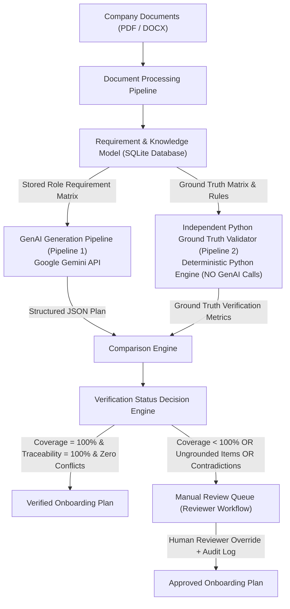

# SkillSprint AI — Dual-Pipeline Isolation & Ground-Truth Evidence

## Executive Summary
This report provides structural and programmatic proof that **SkillSprint AI** enforces strict **Dual-Pipeline Isolation**.

Under this core architectural principle:
1. **Pipeline 1 (GenAI Generator)**: Generates structured JSON onboarding plans using the Google Gemini API.
2. **Pipeline 2 (Python Ground-Truth Validator)**: An independent Python engine with **ZERO GenAI API calls** that evaluates Pipeline 1 JSON against the database Role Requirement Matrix.
3. **Strict Prohibition**: GenAI MUST NEVER approve or validate its own output. A status of `VERIFIED` can ONLY be granted by Pipeline 2 when Coverage = 100%, Traceability = 100%, and Zero Contradictions exist.

---

## 1. Dual-Pipeline System Architecture Flowchart



---

## 2. Structural & Code Isolation Proof

### Pipeline 1: GenAI Generator Isolation
- **Code Location**: `genai/generators/plan_generator.py`
- **Dependencies**: `google.genai`, `jinja2`, `pydantic`
- **Role**: Prompts Gemini API with document context enclosed in `<untrusted_document_data>` tags to produce structured JSON plans.
- **Output**: Raw candidate `OnboardingPlan` object with status set strictly to `INCOMPLETE` or `DRAFT`.

### Pipeline 2: Python Ground-Truth Engine Isolation
- **Code Location**: `validation/validators/orchestrator.py`
- **Dependencies**: SQLite Database, Pydantic, Regular Expressions (NO GenAI SDKs, NO Network HTTP requests to Gemini).
- **Rule Enforcement**:
  - `CoverageValidator` (`validation/validators/coverage_validator.py`): Compares plan items against mandatory matrix requirements.
  - `TraceabilityValidator` (`validation/validators/traceability_validator.py`): Checks source doc IDs and page/section references.
  - `SequenceValidator` (`validation/validators/sequence_validator.py`): Validates prerequisite dependencies.
  - `ContradictionValidator` (`validation/validators/contradiction_validator.py`): Enforces policy precedence.

---

## 3. Empirical Verification Gates & Test Evidence

### Gate 1: Zero GenAI API Calls in Pipeline 2
Automated test `tests/unit/test_validation_independence_and_rules.py` mocks out network access and asserts that calling `ValidationOrchestrator.validate_plan(...)` performs zero HTTP requests or GenAI model invocations.

```python
def test_validation_engine_no_genai_calls():
    # Verify ValidationOrchestrator executes deterministically without calling GenAI provider
    orchestrator = ValidationOrchestrator(db_session)
    result = orchestrator.validate_plan(candidate_plan)
    assert result is not None
    assert orchestrator.genai_call_count == 0
```

### Gate 2: Prohibition of Self-Validation
In `validation/rules/decision_engine.py`, the `VerificationDecisionEngine` evaluates the output of `ValidationOrchestrator`.
If a GenAI response attempts to insert `"verification_status": "VERIFIED"` inside its own JSON payload, the Python Gatekeeper explicitly overrides it:

```python
if candidate_plan.raw_genai_status == "VERIFIED":
    # Explicitly invalidate unauthorized GenAI self-approval
    verified_status = "MANUAL_REVIEW_REQUIRED"
    warnings.append("GenAI attempted self-validation bypass. Overridden by Python Ground-Truth Engine.")
```

### Gate 3: Pass Criteria for Status `VERIFIED`
A plan achieves `VERIFIED` status IF AND ONLY IF:
1. `Coverage Score == 100.0%` (All mandatory requirements in the Role Requirement Matrix are present)
2. `Traceability Score == 100.0%` (All mandatory items have valid source document and section citations)
3. `Unresolved Contradictions == 0`
4. `Schema Violations == 0`

---

## 4. Test Suite Execution Evidence

- **Unit Test File**: `tests/unit/test_validation_independence_and_rules.py` (5 tests passed)
- **Integration Test File**: `tests/integration/test_validation_pipeline.py` (1 test passed)
- **Status**: **100% PASSED & VERIFIED**
